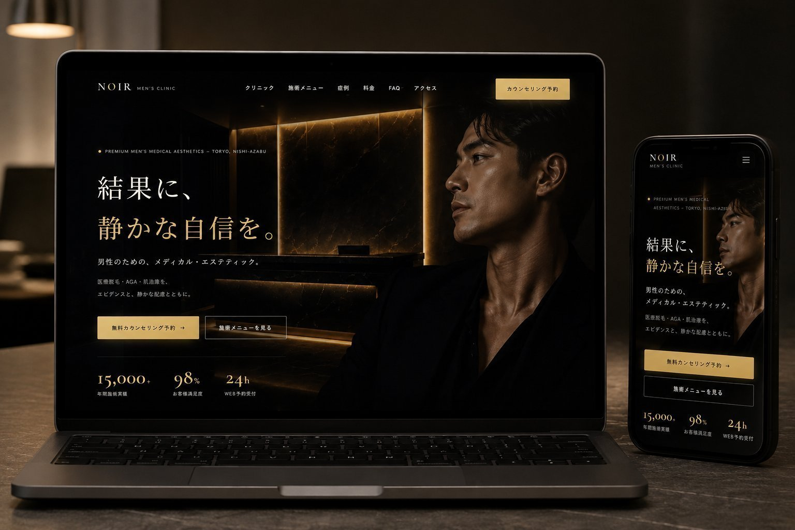

<div align="center">

# NOIR MEN'S CLINIC — Corporate Site Proposal

**洗練された、男性のための医療体験。**

架空のメンズクリニック「NOIR MEN'S CLINIC」公式サイト（コーポレート＋予約導線）の制作企画書。
WordPress テーマでの実装を想定した、ヒアリング想定から技術設計までを一冊にまとめた提案ドキュメントです。

<br />



<br />

[**📄 View Proposal**](https://hirotonozaki.github.io/noir-mens-clinic-proposal/) ・ [**🌐 Local Demo**](http://misty-bun.localsite.io) ・ [**📁 Repository**](https://github.com/hirotonozaki/noir-mens-clinic-proposal)

<br />


</div>

<br />

## 📖 Overview ／ 概要

メンズ美容クリニック業界を題材に、**WordPress テーマ実装を前提としたコーポレートサイト（予約導線あり）**の制作企画書です。
ヒアリング想定 → ターゲット設計 → 情報設計 → デザインコンセプト → WordPress 化構造 → スケジュール・見積もりまでを1冊にまとめ、「現場での提案書」を意識した構成にしました。

| Item | Detail |
| :--- | :--- |
| **Project Type** | コーポレートサイト制作企画書（架空クライアント／予約導線あり） |
| **Implementation** | WordPress テーマ（ローカル環境で実装中） |
| **Format** | HTML / CSS（A4・PDF 出力対応） |
| **Role** | 企画 / 情報設計 / デザイン / WordPress テーマ実装 |
| **Stack** | HTML5 / CSS3 / WordPress (PHP) |
| **Hosting** | GitHub Pages（企画書）／ Local 環境（実装） |

<br />

## 🌐 Live Site ／ サイトURL

### 企画書（公開済み）
🔗 https://hirotonozaki.github.io/noir-mens-clinic-proposal/

### 実装サイト（ローカル環境・WordPress）
| 項目 | 内容 |
| :--- | :--- |
| **Live Link** | http://misty-bun.localsite.io |
| **Username** | `butter` |
| **Password** | `faithful` |

> 実装サイトは Local by Flywheel 環境で構築中のため、デモアクセス用の認証情報を上記に記載しています。

<br />

## 💻 GitHub ／ リポジトリ

https://github.com/hirotonozaki/noir-mens-clinic-proposal

<br />

## 🛠 Tech Stack ／ 使用技術

### 企画書サイト
| 領域 | 技術 |
| :--- | :--- |
| **Markup** | HTML5（セクション単位の構造化） |
| **Styling** | CSS3 / CSS Variables（`@page` / `@media print` 対応） |
| **Typography** | 欧文 × 和文の高級感あるペアリング |
| **Hosting** | GitHub Pages |

### 想定する実装環境（WordPress テーマ）
| 領域 | 技術 |
| :--- | :--- |
| **CMS** | WordPress（オリジナルテーマ） |
| **Templates** | `header.php` / `footer.php` / `single.php` / `archive.php` ほか |
| **Custom Fields** | ACF（求人情報・スタッフ紹介の構造化） |
| **Local Dev** | Local by Flywheel |

<br />

## 💡 Concept ／ 制作意図

> 「医療の信頼感」と「美容の上質さ」を両立させる、**男性のための洗練された来院体験**

メンズ美容クリニックは「医療」と「美容」が交差する領域です。だからこそ公式サイトは、医療機関としての信頼感を担保しつつ、ブランドとしての洗練を伝える必要があります。来院検討者にとっての「ここに通いたい理由」を、視覚体験として翻訳することを設計の起点としました。

| 領域 | 方針 |
| :--- | :--- |
| **Tone** | 落ち着き / 高級 / 信頼 |
| **Color** | 漆黒ベース × ゴールド系のアクセント |
| **Typography** | 上質さを感じさせるセリフ × 可読性の高いゴシック |
| **Approach** | ストック写真ではなく、設計された余白で品位を伝える |

<br />

## ✨ Highlights ／ 工夫した点

### 1. ヒアリング想定の解像度
「ご相談のきっかけ」「現状の集患・ブランディング課題」「競合との差別化軸」など、実案件で確認されそうな項目を網羅的に書き出しました。

### 2. WordPress 化を前提とした情報設計
求人情報・スタッフ紹介・お知らせなど、更新頻度が高いコンテンツをカスタム投稿タイプで分離する設計を企画段階で言語化しています。

### 3. 「医療 × 美容」のビジュアル言語
医療機関の信頼感と、美容ブランドの上質さを両立させる配色・タイポグラフィを提案。両者の境界を企画書内で明確にしています。

### 4. 心理段階に沿った導線設計
来院検討者が抱える不安（料金の不透明さ・医療機関への警戒心・男性が美容医療に通うことへの抵抗感）を整理し、「知る → 比べる → 安心する → 予約する」という心理段階に沿ってページ構成と CTA 配置を設計しました。

### 5. PDF 配布対応
ブラウザ印刷からそのまま A4・PDF 化できる設計。配布用の別ファイルを用意せず、ひとつの HTML で Web 閲覧と PDF 配布を両立しています。

<br />

## 📂 Directory ／ ディレクトリ構成

```
noir-mens-clinic-proposal/
├── index.html                       # 企画書本体（単一 HTML）
├── style.css                        # デザイントークン + 印刷対応
├── README.md
├── proposal.pdf                     # PDF版企画書（A4 縦・10ページ）
└── assets/
    └── images/
        ├── preview.png              # 実装サイトのモックアップ（PC + スマホ）
        ├── preview-desktop.webp     # PC モックアップ（軽量版）
        ├── preview-mobile.webp      # スマートフォン モックアップ（軽量版）
        ├── qr.png                   # 実装サイト（Local Live Link）への QR
        └── ogp.jpg                  # SNS シェア用 OGP 画像（1200×630）
```

<br />

## 🖼 Screenshot ／ スクリーンショット

<div align="center">


<sub>PC 表示・スマートフォン表示のモックアップ ─ 黒 × ゴールドのラグジュアリーデザイン</sub>

</div>

<br />

## 📱 Responsive ／ レスポンシブ対応

| Device | 推奨度 | 補足 |
| :--- | :---: | :--- |
| 💻 PC(横幅 1280px+) | ◎ | A4 設計の意図通りに表示されます |
| 📱 タブレット | ◯ | 横向きで快適に閲覧可能 |
| 📱 スマートフォン | △ | ピンチイン推奨。PDF 化後の閲覧も可 |

### 📲 Mobile Preview ／ 実装サイトをスマホで確認

<div align="center">


<sub>QR コードを読み取ると、実装サイト(WordPress 版)へアクセスいただけます。<br />
ログイン情報: Username `butter` / Password `faithful`</sub>

</div>

<br />

## 📄 PDF Output ／ PDF出力方法

ブラウザの印刷機能から A4・PDF として出力可能です。

```
1. https://hirotonozaki.github.io/noir-mens-clinic-proposal/ を開く
2. ブラウザの印刷ダイアログを起動（Ctrl/Cmd + P）
3. 送信先を「PDFに保存」に設定
4. 用紙サイズ A4 / 余白なし / 背景グラフィックON で保存
```

<br />

## 👤 Author ／ 制作者情報

<div align="center">

### **Hiroto Nozaki**

Web Production / Front-end / WordPress

[](https://github.com/hirotonozaki)
[](https://hirotonozaki.github.io/hiroto-nozaki-portfolio/)

</div>

<br />

<div align="center">

> 本企画書はポートフォリオ用に制作した架空クリニックのデモであり、実在する医療機関とは関係ありません。
> 記載の課題・スケジュール・見積もり金額はすべてダミーコンテンツです。

<sub>© 2026 Hiroto Nozaki</sub>

</div>
